# Lab 1 — Build Your First OCI Environment

**Egypt Summer Internship Program 2026 — Cloud Build Track (OCI & Terraform)**
**Week 1 — OCI Foundations & Terraform Basics**

| | |
|---|---|
| **Intern** | Andrew Hany |
| **Compartment** | `intern-04-andrew-hany-cmp` |
| **Region** | `me-jeddah-1` — Saudi Arabia West (Jeddah) |
| **Tenancy** | `ociejada` |
| **Date** | 5 August 2026 |

---

## 1. Objective

Deploy a complete, working OCI environment **manually through the OCI Console**, then attach persistent storage:

- A **Virtual Cloud Network (VCN)** with a **public subnet** and internet connectivity
- A **Linux compute instance** reachable over SSH
- A **block volume** attached over iSCSI, formatted, and mounted
- A **file storage** file system mounted over NFS

This is the manual build required by Lab 1. Lab 2 will reproduce the same environment as **Terraform code**.

---

## 2. Architecture

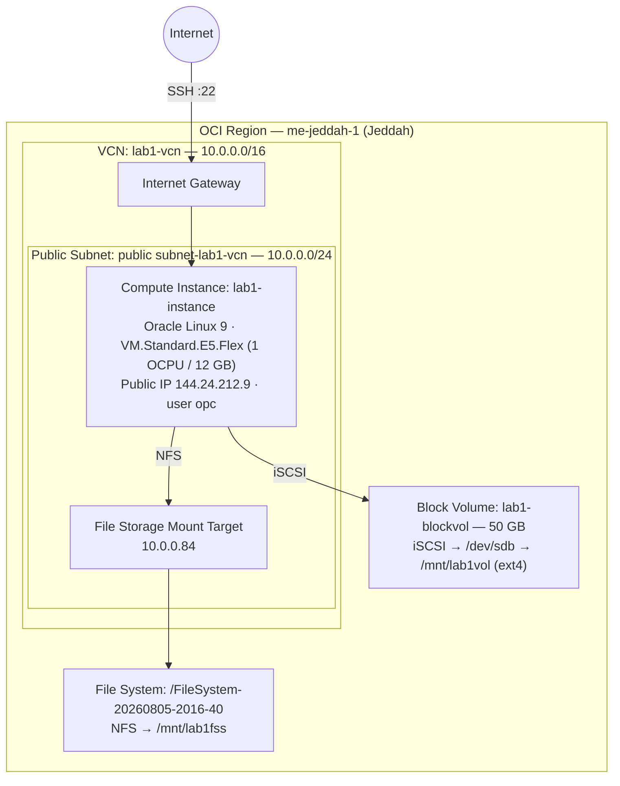

---

## 3. Resource summary

| Resource | Name / Value |
|---|---|
| Region | `me-jeddah-1` (Saudi Arabia West — Jeddah) |
| Compartment | `intern-04-andrew-hany-cmp` |
| VCN | `lab1-vcn` — CIDR `10.0.0.0/16` |
| Public subnet | `public subnet-lab1-vcn` — CIDR `10.0.0.0/24` |
| Gateways (from VCN Wizard) | Internet Gateway, NAT Gateway, Service Gateway |
| Compute instance | `lab1-instance` — Oracle Linux 9 |
| Shape | `VM.Standard.E5.Flex` — 1 OCPU / 12 GB RAM |
| Availability domain | AD-1 |
| Public IP / user | `144.24.212.9` / `opc` |
| Block volume | `lab1-blockvol` — 50 GB · iSCSI · `/dev/sdb` → `/mnt/lab1vol` (ext4) |
| File system export | `/FileSystem-20260805-2016-40` → `/mnt/lab1fss` |
| Mount target | `MountTarget-20260805-2016-34` — IP `10.0.0.84` |

---

## 4. Deployment steps

### Step 0 — Work in the correct compartment

All resources are created inside the personal intern compartment `intern-04-andrew-hany-cmp` (never the tenancy root), so they stay isolated and easy to clean up.

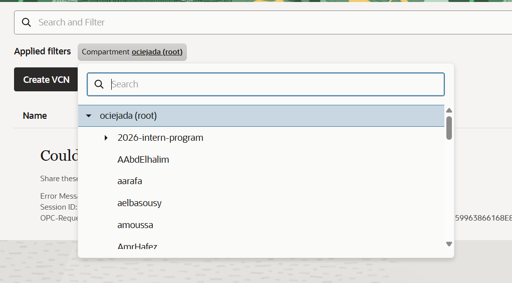

### Step 1 — Create the VCN (VCN Wizard)

**Networking → Virtual Cloud Networks → Start VCN Wizard → Create VCN with Internet Connectivity.**
Named `lab1-vcn`, kept the default CIDRs. The wizard creates the VCN, a public subnet, an internet gateway, a route table, and security lists in a single step.

### Step 2 — Launch the compute instance

**Compute → Instances → Create instance.** Image **Oracle Linux 9**, shape **VM.Standard.E5.Flex** (1 OCPU), placed in `lab1-vcn` / `public subnet-lab1-vcn` with **Assign public IPv4 address = Yes**, and an auto-generated SSH key pair (both keys downloaded).

The review below confirms the networking is correct — the single most important setting for SSH access:

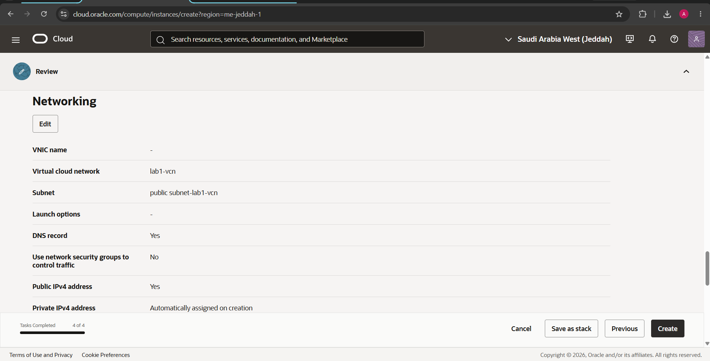

After creation the instance reached **RUNNING** with a public IP:

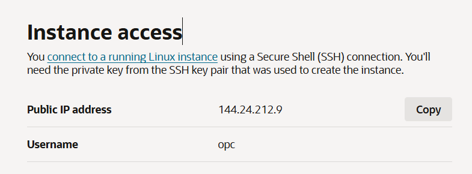

### Step 3 — Connect over SSH

The private key was copied to an NTFS path (`C:\Users\<user>\.ssh\`) and locked to the current user, because Windows/OpenSSH refuses a key that other users can read (and an exFAT/FAT32 drive cannot enforce that restriction):

```powershell
icacls ssh-key-2026-08-05.key /inheritance:r
icacls ssh-key-2026-08-05.key /grant:r "$($env:USERNAME):R"
ssh -i ssh-key-2026-08-05.key opc@144.24.212.9
```

A successful login lands at the `[opc@lab1-instance ~]$` prompt (visible in the terminal screenshots below).

### Step 4 — Create, attach, and mount the block volume

**Storage → Block Volumes → Create Block Volume** in AD-1. The default size was **1024 GB**; I switched to **Custom** and set **50 GB** to right-size for the lab and avoid wasting shared credits (cost awareness / FinOps):

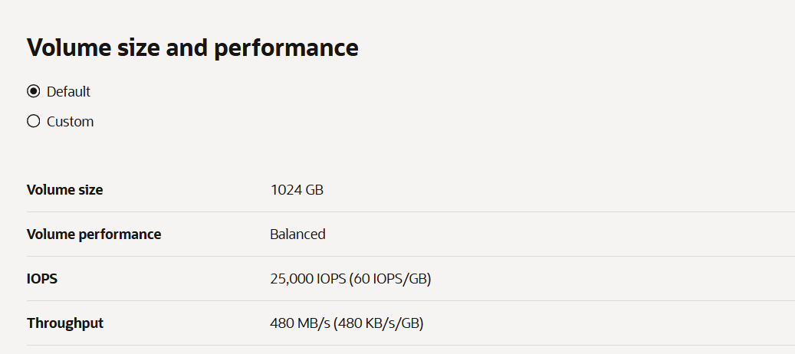

Then attached it to the instance as **iSCSI**. The Console shows the post-attach instructions (run the iSCSI connect commands, then format and mount; unmount before ever detaching):

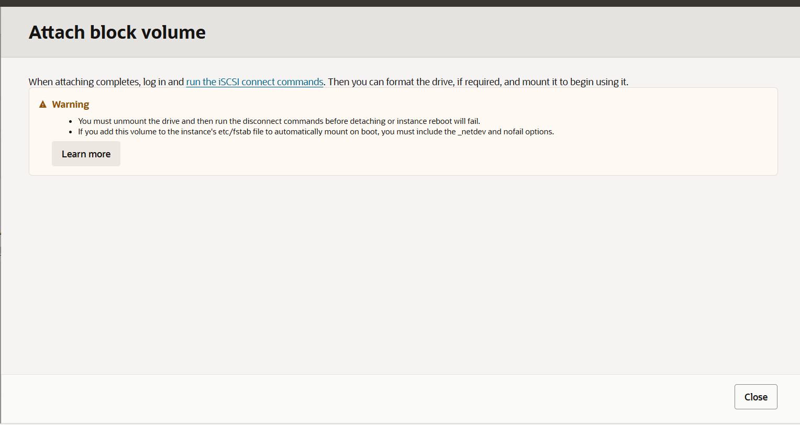

On the instance, I ran the iSCSI **Connect** commands (from **⋮ → iSCSI commands and information**):

```bash
sudo iscsiadm -m node -o new    -T <target-iqn> -p 169.254.2.2:3260
sudo iscsiadm -m node -o update -T <target-iqn> -n node.startup -v automatic
sudo iscsiadm -m node          -T <target-iqn> -p 169.254.2.2:3260 -l   # → "Login ... successful"
```

`lsblk` then shows the new 50 GB disk as **`sdb`** (boot disk is `sda`):

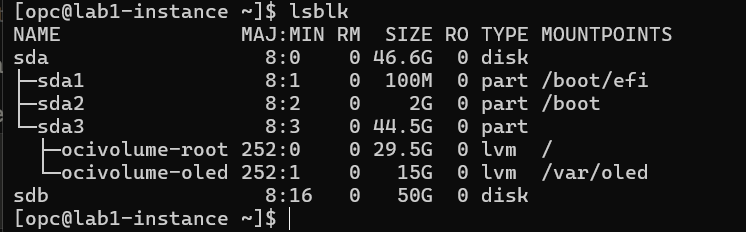

Format with ext4, create a mount point, mount, and verify:

```bash
sudo mkfs.ext4 /dev/sdb
sudo mkdir /mnt/lab1vol
sudo mount /dev/sdb /mnt/lab1vol
df -h
```

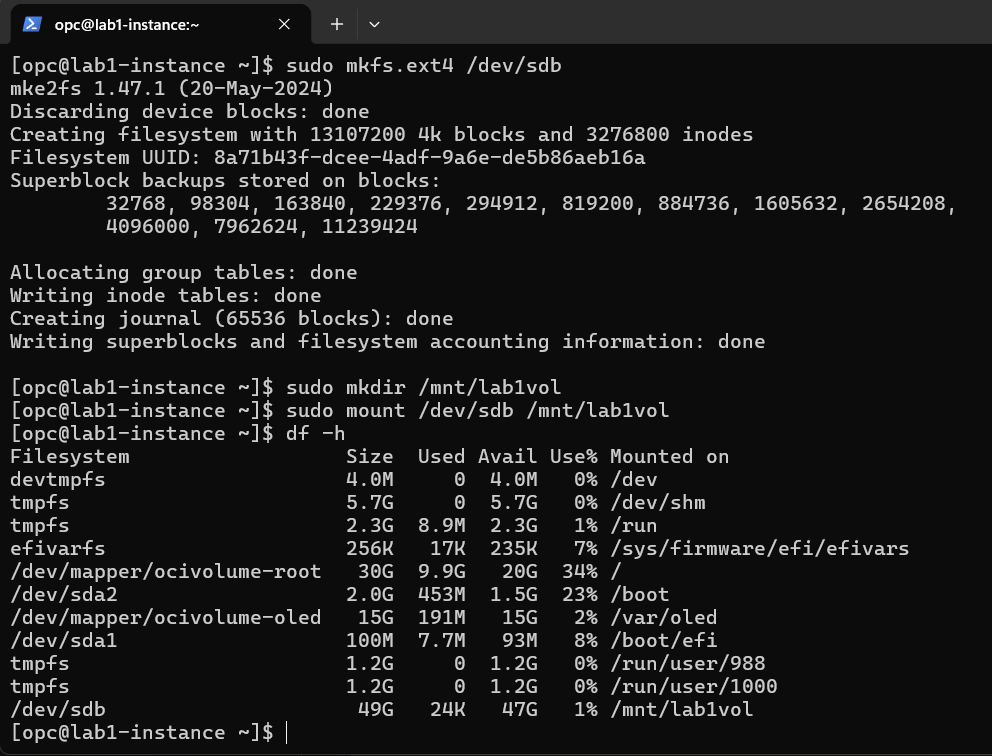

> **What iSCSI does:** the block volume lives elsewhere in the data center and is presented to the instance *over the network* as though it were a locally attached disk. `-o new` registers it, `node.startup automatic` reconnects it on reboot, `-l` logs in now.

### Step 5 — Create and mount file storage (NFS)

**Storage → File Systems → Create File System**, with a mount target in `lab1-vcn` / `public subnet-lab1-vcn`. The export path and mount target came out **Active**:

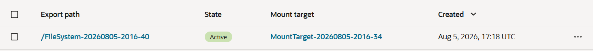

- Export path: `/FileSystem-20260805-2016-40`
- Mount target IP: `10.0.0.84`

NFS traffic then has to be allowed on the subnet's security list. The default rules already open SSH (22) and ICMP; I added a **stateful** rule allowing intra-VCN TCP from `10.0.0.0/16`, which covers the NFS ports (111 and 2048–2050) between the instance and the mount target:

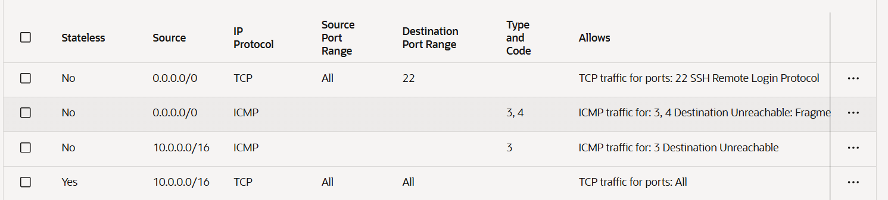

Finally, install the NFS client, create a mount point, and mount the file system:

```bash
sudo yum install -y nfs-utils
sudo mkdir -p /mnt/lab1fss
sudo mount 10.0.0.84:/FileSystem-20260805-2016-40 /mnt/lab1fss
df -h
```

---

## 5. Verification

`df -h` confirms **both** storage types mounted — block volume at `/mnt/lab1vol` and file storage at `/mnt/lab1fss`:

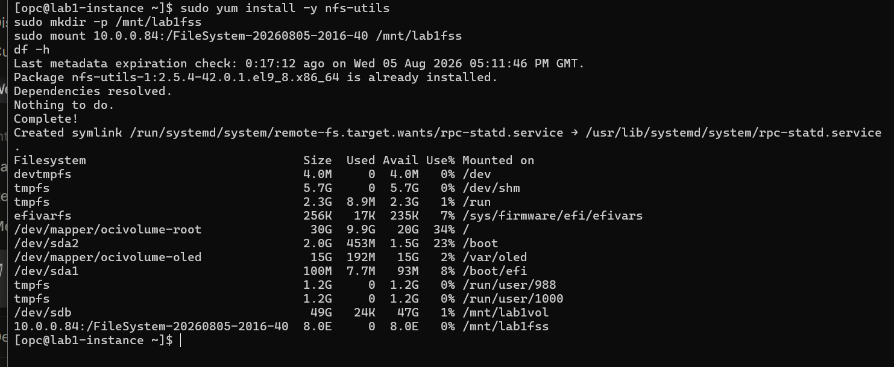

```
/dev/sdb                                49G    24K   47G   1%  /mnt/lab1vol
10.0.0.84:/FileSystem-20260805-2016-40  8.0E     0  8.0E   0%  /mnt/lab1fss
```

> `8.0E` is how OCI File Storage reports capacity — it is thin-provisioned, so you only pay per GB actually stored.

**Lab 1 result:** VCN ✅ · public subnet ✅ · Linux instance ✅ · SSH access ✅ · block volume ✅ · file storage ✅

---

## 6. Cleanup (mandatory after review)

Cloud resources bill for as long as they exist, and this is a **shared tenancy**, so everything is removed after the mentor review. Order matters — storage must be released before the instance is terminated:

```bash
# On the instance
sudo umount /mnt/lab1fss
sudo umount /mnt/lab1vol
sudo iscsiadm -m node -T <target-iqn> -p 169.254.2.2:3260 -u   # iSCSI logout
```

Then in the Console, delete in this order:
1. Detach and delete the **block volume** (`lab1-blockvol`)
2. Delete the **file system** and **mount target**
3. Terminate the **instance** (`lab1-instance`) — tick "delete boot volume"
4. Delete the **VCN** (`lab1-vcn`) last

---

## 7. What I learned

- **Region → Availability Domain → Fault Domain** is a strict hierarchy; a VCN and its subnets are regional, and resources live inside a compartment.
- The **VCN Wizard** wires up subnet + gateways + route table + security list together — exactly the pieces a server needs to be reachable.
- **Security lists are the gate:** SSH worked out of the box (port 22 open by default), but NFS required explicitly allowing the file-storage ports within the VCN.
- **Storage is attached, not built-in:** a block volume connects over iSCSI (a network disk that behaves like a local one); file storage connects over NFS (a shared network drive). Both must be formatted/mounted before use.
- Right-sizing the block volume (1024 GB → 50 GB) is a small but real **cost-awareness (FinOps)** decision on a shared tenancy.
- Building this by hand makes the upcoming **Terraform** version straightforward — every resource here maps directly to a Terraform block.
```
